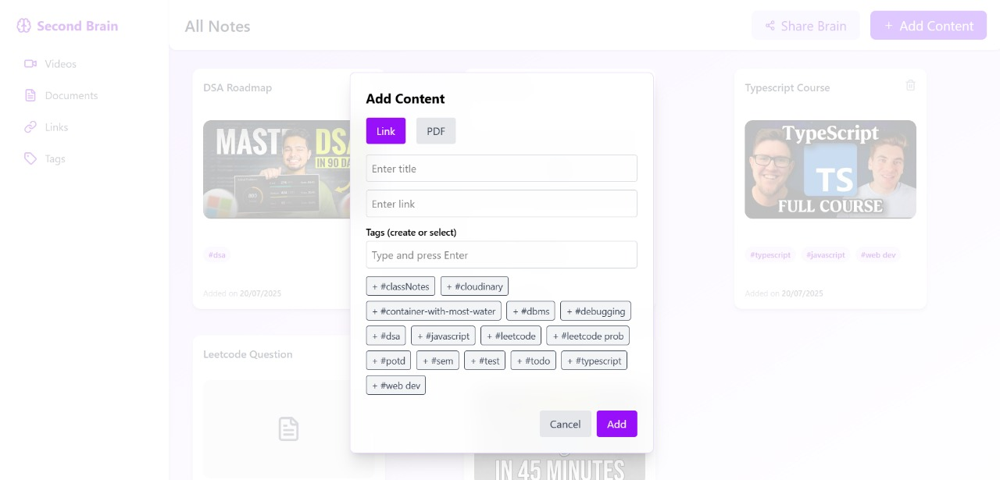
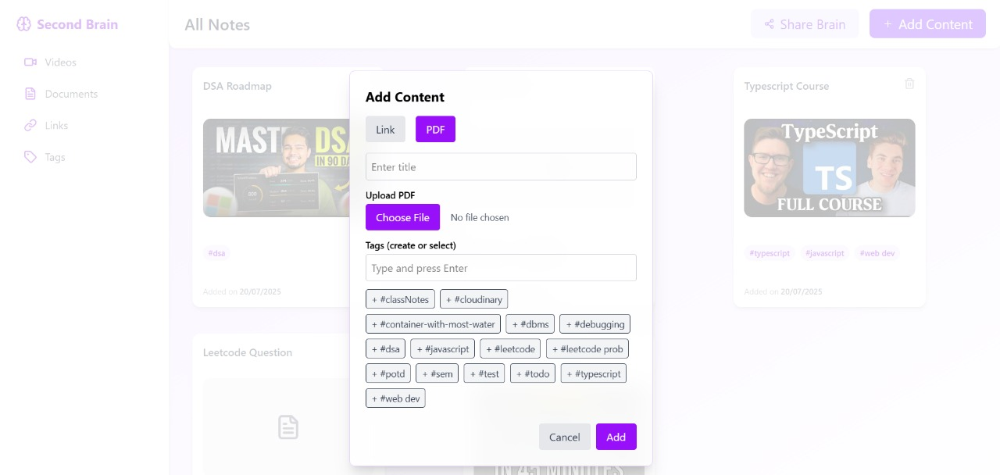

# 🧠 BrainBoard – Your Second Brain App

**BrainBoard** is a full-stack **Second Brain App** built using the **MERN stack (TypeScript)**, designed to help you centralize and organize content from multiple platforms like **YouTube**, **Twitter**, **Google Docs**, and even **PDFs** — all in one place.

---

## ⚙️ Features

- 📥 **Add content** from YouTube, Twitter, Google Docs, or custom links
- 📄 **Upload PDFs** using Cloudinary + Multer
- 🖼️ Auto-fetch **YouTube thumbnails** for video links
- 🧠 **Organize content** with **dynamic tags** and types
- 🔗 One-click **redirect to original sources**
- 🔐 **User authentication** with JWT
- 📤 **Share your brain** (collection) with others via a unique share link
- ❌ Secure delete functionality for personal cleanup

---

## 🧪 Tech Stack

### 🧩 Frontend

- React + TypeScript
- Tailwind CSS
- Headless UI
- Lucide Icons
- Vite

### 🧠 Backend

- Node.js + Express (TypeScript)
- MongoDB with Mongoose
- Multer for file upload
- Cloudinary for PDF storage
- Cookies for authentication

---

## 🚀 How to Run Locally

1. **Clone the repository**

   ```bash
   git clone https://github.com/your-username/movie-favorites-app.git
   cd movie-favorites-app

   ```

2. **Install dependencies**
    ```bash
        npm install

    ```

3. **Environment Variables**

- Make sure to create .env files for both backend and frontend with appropriate keys such as:

    🗂️Backend .env
    ```bash
    PORT=5000
        MONGO_URI=your_mongodb_uri
        JWT_SECRET=your_jwt_secret
        CLOUDINARY_CLOUD_NAME=your_cloud_name
        CLOUDINARY_API_KEY=your_api_key
        CLOUDINARY_API_SECRET=your_api_secret
        FRONTEND_BASE_URL=http://localhost:5173
    ```
    🗂️Frontend .env
    ```bash
    VITE_API_BASE_URL=http://localhost:5000/api/v1
        VITE_CLOUDINARY_PRESET=brain-pdf
        VITE_CLOUDINARY_CLOUD_NAME=your_cloud_name
    ```

4. **Start the backend server**
   ```bash
    cd backend
    npm run dev

   ```

5. **Start the frontend server**
   ```bash
    cd frontend
    npm run dev

   ```
---

## 📸 Screenshots

|  |  |
|:--:|:--:|
| **Initial Loader** | **Signup Page** |

|  |  |
|:--:|:--:|
| **Signin Page** | **Dashboard View** |

|  |  |
|:--:|:--:|
| **Add Content Modal (for links)** | **Add Content Modal (for PDFs)** |

|  |  |
|:--:|:--:|
| **ShareBrain Modal** | **Shared Brain Page** |

---

## Feel free to contact 👇
https://www.linkedin.com/in/sanjana-dutta-499710291/

---
